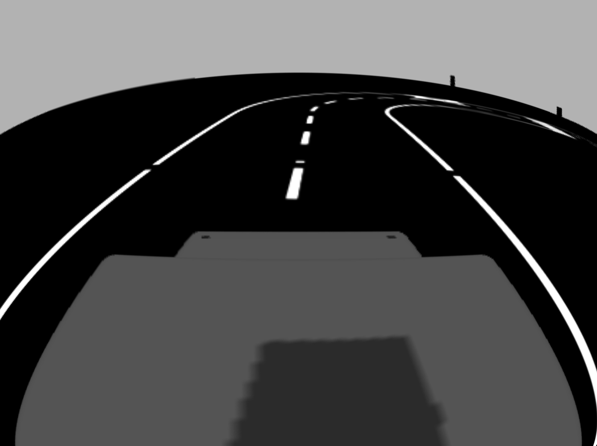
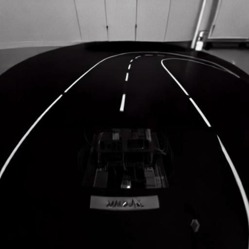
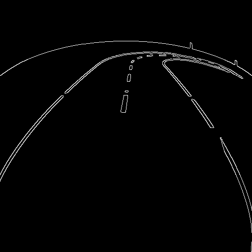

# Image-to-Image Translation: Sim2Real Gap Überbrückung

Dieses Projekt implementiert zwei verschiedene Ansätze zur Image-to-Image-Translation, um den **Sim2Real Gap** zwischen Simulationsaufnahmen aus Gazebo und Realaufnahmen zu schließen. 

## 📋 Überblick

Das Projekt enthält zwei parallele Implementierungen verschiedener Modellansätze:

### 1. **ControlNet** 
Ein auf Stable Diffusion basierter Ansatz, der zusätzliche Steuerinformationen (wie Kantendetektionen) nutzt, um die Struktur der Eingabebilder zu erhalten.

### 2. **CycleGAN**
Ein GAN-basierter Ansatz, der ohne gepaarte Trainingsbilder auskommt und durch Zyklische Konsistenz lernt.

Es hat sich gezeigt, dass ControlNet eine bessere Strukturerhaltung bietet, während CycleGAN realistischere Details generieren kann. 

## 🔄 Der Sim2Real Gap

Der Sim2Real Gap beschreibt die Unterschiede zwischen synthetischen Trainingsdaten und realen Daten, die dazu führen, dass mit Simulationsdaten trainierte Modelle bei der Übertragung auf reale Szenen schlechter performen. Typische Unterschiede umfassen:

- Beleuchtung und Schatten
- Texturen und Material-Eigenschaften
- Farbtöne und Kontraste
- Umgebungsdetails

## 🎯 Verwendung

Beide Ansätze haben ihr eigenes Setup und ihre Dokumentation:

- **[ControlNet Setup & Anleitung](ControlNet/Anleitung.md)** - Detaillierte Schritte für Dataset-Vorbereitung, Training und Inferenz
- **[CycleGAN Setup & Anleitung](CycleGAN/)** - Dokumentation für den GAN-basierten Ansatz

## 🏗️ Wie ControlNet funktioniert

ControlNet erweitert Stable Diffusion mit zusätzlichen Eingabeinformationen, um präzise Kontrolle über die Generierung zu ermöglichen:

```
Simulationsbild
      ↓
Canny Edge Detection (Kantenberechnung)
      ↓
ControlNet Encoder (extrahiert Strukturinformationen)
      ↓
Stable Diffusion UNet (generiert Bild mit Struktur-Bedingung)
      ↓
LoRA (Low-Rank Adaptation) (transferiert Realismus basierend auf trainiertem Datensatz)
      ↓
Realistisches Bild
```

In diesem Projekt werden Canny Edges als Steuerinformationen verwendet, um die Struktur der Simulationsbilder zu erhalten, während LoRA dazu beiträgt, realistische Details basierend auf den Trainingsdaten zu generieren.

## 📊 Beispiele

### ControlNet Pipeline

<div style="display: flex; gap: 30px; align-items: flex-start;">
  <div style="flex: 1;">
    <strong>Simulationsbild:</strong><br>
    
  </div>
  <div style="flex: 1;">
    <strong>Übersetztes Bild (ControlNet):</strong><br>
    <br><br>
    <strong>Canny Edges:</strong><br>
    
  </div>
</div>


## 📁 Projektstruktur

```
image-to-image/
├── ControlNet/           # Stable Diffusion + ControlNet Implementierung
│   ├── Anleitung.md     # Detaillierte Setup- und Trainingsanleitung
│   ├── scripts/         # Training und Preprocessing Scripts
│   ├── outputs/         # Generierte Bilder und Modell-Outputs
│   └── model/          # ControlNet Gewichte
├── CycleGAN/            # CycleGAN Implementierung
│   ├── Anleitung.md     # CycleGAN Setup
│   └── ...
└── README.md            # Dieses Dokument
```

## 🚀 Schnelleinstieg

1. **ControlNet:**
   ```bash
   cd ControlNet
   # Folge der Anleitung.md
   ```

2. **CycleGAN:**
   ```bash
   cd CycleGAN
   # Folge der Anleitung.md
   ```

